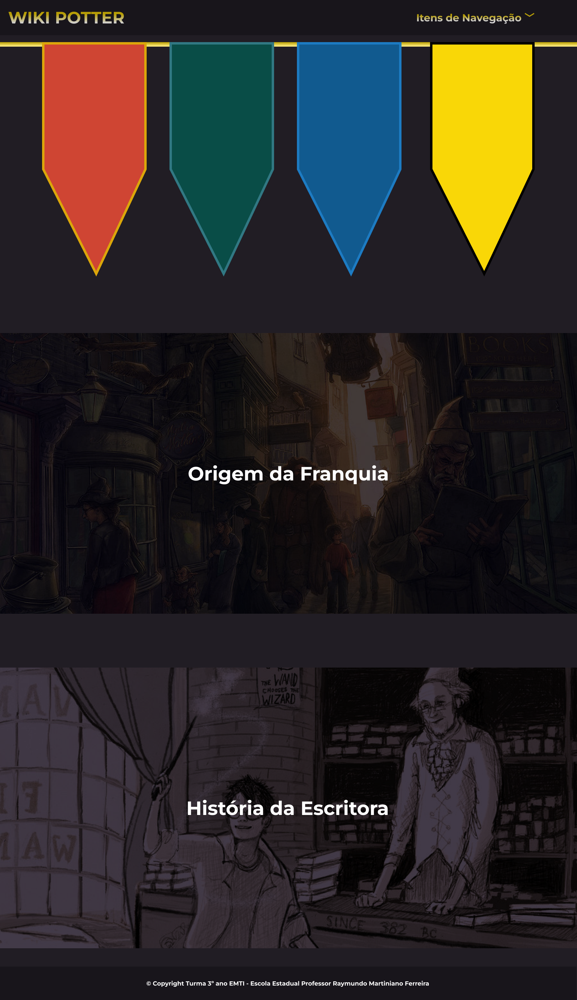
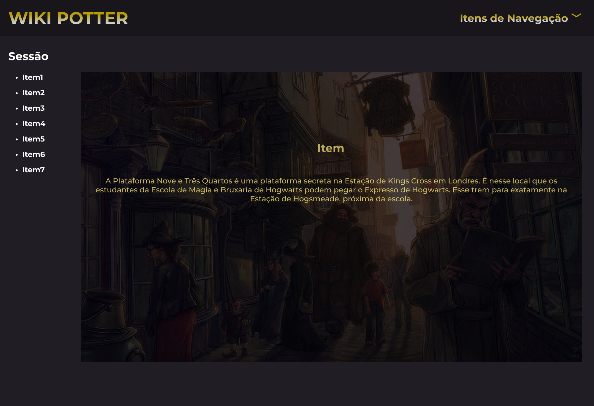
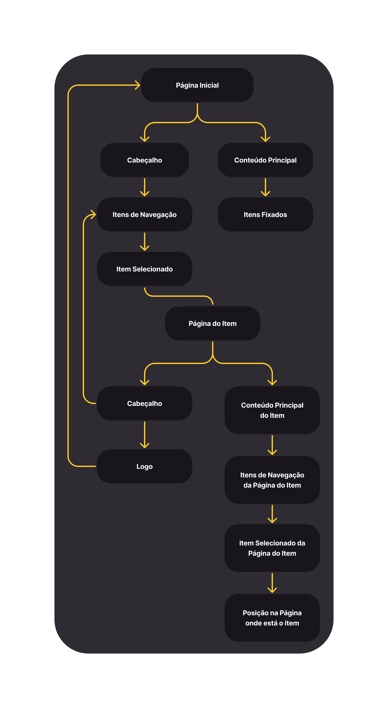
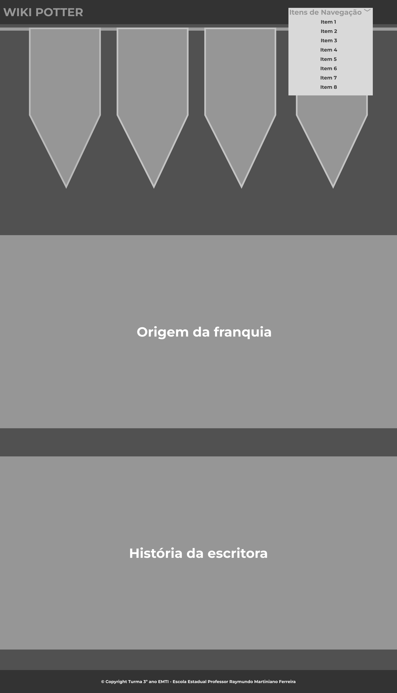
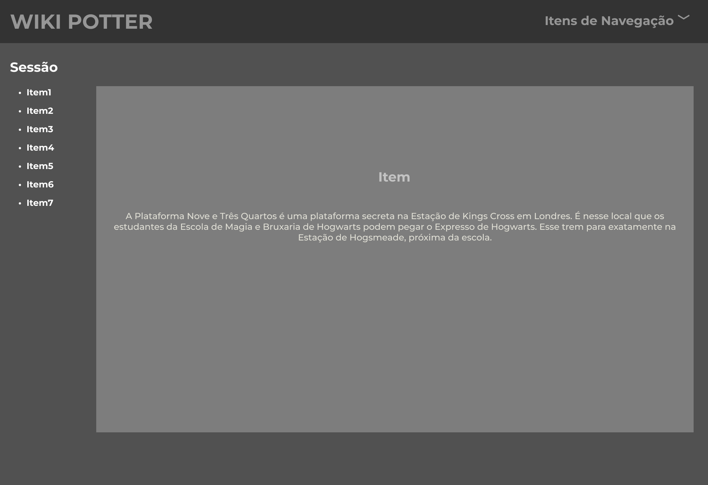

<h1 align="center">Wiki Potter</h1>

## Sumário
* <a href="#introdução">Introdução</a>
* <a href="#problemas">Problemas</a>
* <a href="#objetivos">Objetivos</a>
* <a href="#público-alvo">Público-Alvo</a>
* <a href="#requisitos-funcionais">Requisitos Funcionais</a>
* <a href="#requisitos-não-funcionais">Requisitos não Funcionais</a>
* <a href="#template-do-site">Template do Site</a>
* <a href="#user-flow">User Flow</a>
* <a href="#wireframes">Wireframes</a>
* <a href="#responsáveis-do-projeto">Responsáveis do Projeto</a>
* <a href="#fontes">Fontes</a>

 

<h2 align="center" id="introdução">Introdução</h2>
 
Este projeto, criado pelos alunos do Ensino Médio, que consiste em uma criação de um site de wikipedia da franquia Harry Potter, no qual as pessoas poderão achar informações confiáveis e em Português.

 

<h2 align="center" id="problemas">Problemas</h2>
 
Dificuldade de acesso à informações confiáveis sobre o mundo da franquia Harry Potter. A começar, é quase inexistente fontes sobre o tema traduzidas para o Português, como por exemplo: as 4 casas de Hogwarts, o acervo da biblioteca de Hogwarts, as varinhas usadas na franquia, o histórico das famílias mais famosas, informações adicionais sobre as ambientações populares da narrativa, além das sequências dos livros e filmes.

 

<h2 align="center" id="objetivos">Objetivos</h2>
 
Criar um site com informações sobre o mundo da franquia Harry Potter, com as casas dos bruxos em Hogwarts, áreas da magia, a biblioteca de Hogwarts, varinhas famosas, famílias mais faladas, animais fantasticos, lugares mais famosos e sequências de livros e filmes da franquia.

 

<h2 align="center" id="público-alvo">Público-Alvo</h2>
 
A comunidade de Harry Potter que possui dificuldade em achar informações reais e em Português.

 

<h2 align="center" id="requisitos-funcionais">Requisitos Funcionais</h2>
 

* Ter uma animação ao passar o mouse em cima de uma imagem e aparecer o título do item que a imagem representa.
* Retornar a página inical ao clicar na logo.
* Imagens nítidas que atendam o padrão de 720p ou mais.

 

<h2 align="center" id="requisitos-não-funcionais">Requisitos não funcionais</h2>
 

* Origem da franquia.
* História da escritora.
* Informações reais sobre a franquia.

 

<h2 align="center" id="template-do-site">Template do Site</h2>

### Página Inicial:
</img>

### Página de Consulta da Sessão:
</img>

 

<h2 align="center" id="user-flow">User Flow</h2>

<h2 align="center" id="wireframes">WireFrames</h2>
 

 

<h2 align="center" id="responsáveis-do-projeto">Responsáveis do Projeto</h2>
 

Product Owner: Luiz Miguel Rosa Lazarini Rubio

Gabriel Loredo de Moraes Mello\
Kamylle Silveira e Silva

Professor Orientador: Iugor Sette

 

<h2 align="center" id="fontes">Fontes</h2>
 

https://harrypotter.fandom.com/pt-br/wiki/Profeta_Di%C3%A1rio 
https://www.deviantart.com/  
https://rpgmb-forccinari.weebly.com/famiacutelias-oficiais.html